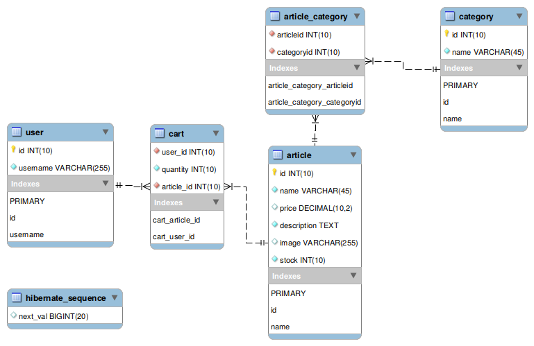
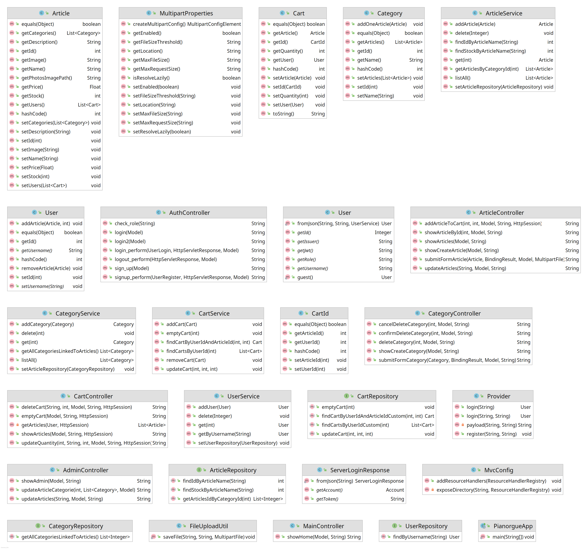

# PIANORGUE

Pianorgue est un site e-commerce de vente d'instruments de musique.

## Prérequis

**Installation de Maven**

* [Installer Maven](https://maven.apache.org/install.html)

* [Documentation](https://maven.apache.org/guides/introduction/introduction-to-the-lifecycle.html)

  

## Installation de l'application

### Récupération du code source

Le code source est disponible sur [Github](https://github.com/g-roch/amt-project), la branche de l'application est la branche `main`.

On peut cloner le repos : 

```bash
git clone git@github.com:g-roch/amt-project.git
```


### Mise en place

Pour fonctionner en local, l'application nécessite une base de donnée en local. [MySQLWorkbench](https://dev.mysql.com/downloads/workbench/) est utilité dans ce projet, d'autres alternative existent mais nous conseillons d'utiliser cet outil. 

Une fois l'outil installé et le serveur SQL démarré, il est nécessaire exécuter les scripts suivants : 

* `amt_pianorgue.sql` qui permet la création des table de la DB.
* `insert_articles.sql` qui permet de peupler les tables en insérant des articles 


Il est à noté qu'il faut s'assurer ensuite de la bonne configuration de la DB dans le code source de l'application, cela se trouve dans le fichier `application/src/main/resources/application.properties`.

Les ligne à vérifier sont : 

* spring.datasource.url=jdbc:mysql://`localhost:3306/amt_pianorgue`

  *Adresse locale (localhost), port (3306) ainsi que nom de la DB (amt_pianorgue)*

* spring.datasource.username=`userAmt `

  *Nom utilisateur de la DB*

* spring.datasource.password=`RooT@@123`

  *Mot de passe de la DB*


### Lancement de l'application

* Pour construire le binaire : 

  ```sh
  cd application/
  mvn clean package
  ```

​	   L'application se trouve à l'emplacement `application/target/AMT-Test-.....jar`


* Pour lancer l'application depuis un IDE :

  Exécuter le fichier `application/src/main/java/com/amt/app/PianorgueApp.java`


### Accès au service d'authentification (pour le développement)

Afin d'accéder au service d'authentification, le port `localhost:8081` doit être redirigé vers le service d'authentification (`10.0.1.92:8080`). 


## Diagrammes
### UML de la base de donnée



### Diagrammes des classes et de leurs méthodes




## Contribution

Si vous avez des suggestions pour améliorer le projet, veuillez tout d'abord lire toutes les informations qui se trouvent dans le [Wiki](https://github.com/g-roch/amt-project/wiki). Les pull-requests sont les bien venues. Pour les changements majeurs, veuillez ouvrir une [issue](https://github.com/g-roch/amt-project/issues). Veuillez vous assurer de mettre à jour les tests le cas échéant. 

1. Fork le projet
2. Créer sa branche selon les conventions (voir wiki)
3. Commit vos changements 
4. Push sur sa branch
5. Ouvrir une pull request

Si vous voulez rejoindre l'équipe, les informations de contacts se trouve juste en dessous. 
Si vous devez rejoindre notre équipe vous pouvez aller regarder [nos methodologies de travail](https://github.com/g-roch/amt-project/wiki/Pratiques-collaboratives) et rejoindre [notre outil collaboratif](https://github.com/g-roch/amt-project/wiki/Outils-int%C3%A9gration). Au plaisir de travailler avec vous.


## Contacts

- Dylan Canton : dylan.canton@heig-vd.ch

- Christian Zaccaria : christian.zaccaria@heig-vd.ch

- Lucas Gianinetti : lucas.gianinetti@heig-vd.ch

- Gabriel Roch : gabriel.roch@heig-vd.ch

- Nicolas Hungerbühler : nicolas.hungerbuhler@heig-vd.ch

  

## License

[Tout droit reservé, aucune license n'est choisie pour l'instant](https://choosealicense.com/licenses/)

